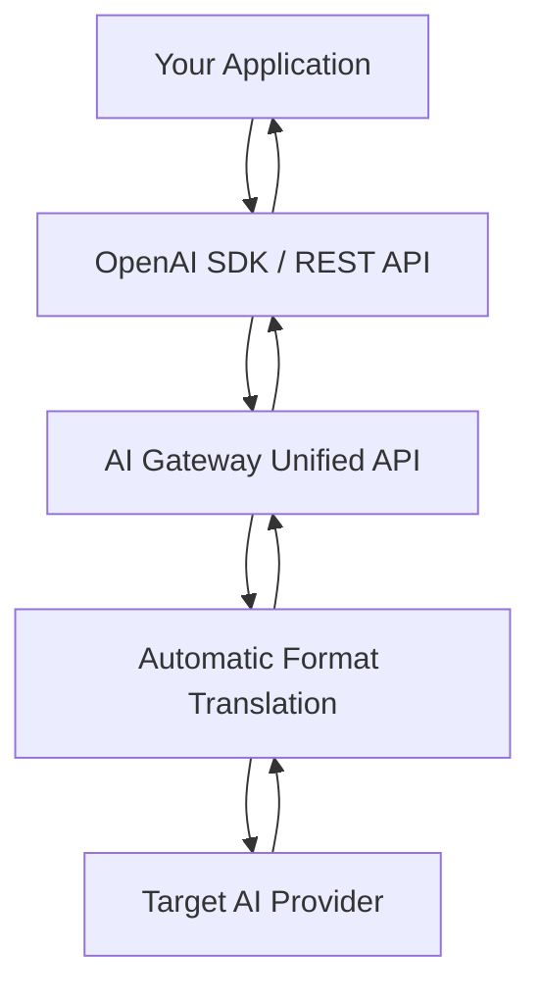

<Note>
The Unified API provides a standardized OpenAI-compatible interface to access multiple AI providers, eliminating vendor lock-in and simplifying integration.
</Note>

## Overview

The Unified API feature provides a single, standardized OpenAI-compatible interface to access 7 major AI providers. This means your applications can communicate with different AI models using the same API format, request structure, and response format - regardless of the underlying provider.

The Unified API feature transforms how enterprises consume AI services by providing a single, standardized interface to multiple AI providers. This approach delivers immediate business value through vendor independence, reduced development costs, and operational simplicity, while maintaining the flexibility to leverage the unique strengths of each AI provider.

By adopting the Unified API, organizations can focus on building innovative AI applications rather than managing complex integrations, ultimately accelerating their AI transformation journey while maintaining full control over their AI strategy.

<CardGroup cols={2}>
  <Card
    title="Vendor Independence"
    icon="shield"
    href="#vendor-independence"
  >
    Switch between 7 leading AI providers without changing application code
  </Card>
  <Card
    title="Accelerated Development"
    icon="zap"
    href="#accelerated-development"
  >
    Use existing OpenAI SDKs with any provider - no learning curve
  </Card>
  <Card
    title="Operational Excellence"
    icon="settings"
    href="#operational-excellence"
  >
    Single endpoint for all AI services with unified monitoring
  </Card>
  <Card
    title="Strategic Flexibility"
    icon="target"
    href="#strategic-flexibility"
  >
    Future-proof architecture that adapts to new AI capabilities
  </Card>
</CardGroup>

## Business Benefits

### Vendor Independence & Risk Mitigation {#vendor-independence}

<CardGroup cols={2}>
  <Card title="Eliminate Vendor Lock-in">
    Switch between 7 leading AI providers without changing a single line of application code
  </Card>
  <Card title="Business Continuity">
    Seamlessly failover to alternative providers during outages or service disruptions
  </Card>
  <Card title="Cost Optimization">
    Compare and switch to more cost-effective providers based on real-time pricing and performance
  </Card>
  <Card title="Load Distribution">
    Distribute AI workloads across multiple providers to avoid single points of failure
  </Card>
</CardGroup>

### Accelerated Time-to-Market {#accelerated-development}

<CardGroup cols={2}>
  <Card title="Rapid Integration">
    Use existing OpenAI SDKs and libraries with any provider - no learning curve
  </Card>
  <Card title="Unified Development">
    One API to learn, one integration to maintain across all AI providers
  </Card>
  <Card title="Reduced Development Costs">
    Eliminate the need for multiple integration teams and specialized expertise
  </Card>
  <Card title="Faster Experimentation">
    Test different AI models and providers without engineering overhead
  </Card>
</CardGroup>

### Operational Excellence {#operational-excellence}

<CardGroup cols={2}>
  <Card title="Simplified Infrastructure">
    Single endpoint for all AI services reduces complexity
  </Card>
  <Card title="Centralized Management">
    Unified monitoring, logging, and security controls across all providers
  </Card>
  <Card title="Compliance Ready">
    Single point for implementing Data and AI governance
  </Card>
  <Card title="Performance Optimization">
    Built-in caching and request optimization across all providers
  </Card>
</CardGroup>

### Strategic Flexibility {#strategic-flexibility}

<CardGroup cols={2}>
  <Card title="Future-Proof Architecture">
    Add new AI providers without modifying existing applications
  </Card>
  <Card title="Best-of-Breed Selection">
    Choose the optimal model for each use case regardless of provider
  </Card>
  <Card title="Negotiation Leverage">
    Stronger position when negotiating with AI vendors due to easy switching capability
  </Card>
  <Card title="Innovation Agility">
    Quickly adopt new AI capabilities as they become available from any provider
  </Card>
</CardGroup>

## Key Capabilities

<CardGroup cols={3}>
  <Card title="OpenAI SDK Compatibility" icon="code">
    Use official OpenAI client libraries with any provider
  </Card>
  <Card title="Consistent API Format" icon="database">
    Same `/v1/chat/completions` endpoint for all providers
  </Card>
  <Card title="Automatic Format Translation" icon="refresh-cw">
    Seamless conversion between OpenAI format and provider-specific formats
  </Card>
  <Card title="Full Feature Support" icon="layers">
    Streaming, function calling, and multi-modal capabilities where available
  </Card>
  <Card title="Zero Code Changes" icon="check-circle">
    Switch providers by changing only configuration headers
  </Card>
  <Card title="Enterprise Controls" icon="shield">
    Built-in guardrails, compliance, and monitoring across all providers
  </Card>
</CardGroup>

## How It Works

### Architecture Flow



### Request Flow

<Steps>
  <Step title="Client Request">
    Your application sends an OpenAI-formatted request
  </Step>
  <Step title="Provider Detection">
    Gateway identifies target provider from headers
  </Step>
  <Step title="Format Translation">
    Request is automatically converted to provider's native format
  </Step>
  <Step title="Provider Call">
    Gateway forwards the transformed request to the AI provider
  </Step>
  <Step title="Response Translation">
    Provider's response is converted back to OpenAI format
  </Step>
  <Step title="Unified Response">
    Your application receives a standard OpenAI-compatible response
  </Step>
</Steps>

## Supported Providers

<CardGroup cols={2}>
  <Card title="OpenAI" icon="zap">
    Access OpenAI models through the unified endpoint with full SDK compatibility
  </Card>
  <Card title="Anthropic" icon="shield">
    Connect to Claude models with built-in guardrails and compliance features
  </Card>
  <Card title="Amazon Bedrock" icon="cloud">
    Integrate AWS Bedrock models with enterprise-grade security controls
  </Card>
  <Card title="Azure OpenAI" icon="microsoft">
    Access Azure-hosted OpenAI models with advanced security features
  </Card>
  <Card title="Azure AI Inference" icon="cpu">
    Leverage Azure AI Inference models through the unified gateway
  </Card>
  <Card title="Google AI" icon="search">
    Integrate Google Gemini models with guardrail enforcement and monitoring
  </Card>
  <Card title="Google Vertex AI" icon="layers">
    Access Vertex AI models with unified endpoints and security controls
  </Card>
</CardGroup>

## Quick Start

<Steps>
  <Step title="Set Up Gateway">
    Deploy the AI Gateway to your infrastructure
  </Step>
  <Step title="Configure Client">
    Use OpenAI SDK with provider-specific headers
  </Step>
  <Step title="Make Requests">
    Send requests using the unified API format
  </Step>
  <Step title="Switch Providers">
    Change providers by updating headers only
  </Step>
</Steps>

## Implementation Examples

All examples use the OpenAI SDK with provider-specific headers to route requests through the AI Gateway.

### Basic Setup Pattern

```python
from openai import OpenAI

client = OpenAI(
    api_key="your-provider-api-key",  # Varies by provider
    base_url="https://your-gateway-url/v1",
    default_headers={
        "x-provider-name": "provider_name",
        "x-altrumai-key": "your-gateway-api-key"
        # Additional provider-specific headers as needed
    }
)
```

### Provider-Specific Examples

<Tabs>
  <Tab title="OpenAI">
    ```python title="openai_example.py"
    from openai import OpenAI

    client = OpenAI(
        api_key="your-openai-api-key",
        base_url="https://your-gateway-url/v1",
        default_headers={
            "x-provider-name": "openai",
            "x-altrumai-key": "your-gateway-api-key"
        }
    )

    response = client.chat.completions.create(
        model="gpt-4",
        messages=[
            {"role": "user", "content": "What is the capital of France?"}
        ]
    )

    print(response.choices[0].message.content)
    ```
  </Tab>
  <Tab title="Anthropic">
    ```python title="anthropic_example.py"
    from openai import OpenAI

    client = OpenAI(
        api_key="your-anthropic-api-key",
        base_url="https://your-gateway-url/v1",
        default_headers={
            "x-api-key": "your-api-key",
            "x-provider-name": "anthropic",
            "x-altrumai-key": "your-gateway-api-key"
        }
    )

    response = client.chat.completions.create(
        model="claude-3-opus-20240229",
        messages=[
            {"role": "user", "content": "Explain quantum computing in simple terms."}
        ]
    )

    print(response.choices[0].message.content)
    ```
  </Tab>
  <Tab title="Amazon Bedrock">
    ```python title="bedrock_example.py"
    from openai import OpenAI

    client = OpenAI(
        api_key="unused-placeholder",  # Not used, credentials via headers
        base_url="https://your-gateway-url/v1",
        default_headers={
            "x-provider-name": "bedrock",
            "x-bedrock-access-key-id": "your-aws-access-key-id",
            "x-bedrock-secret-access-key": "your-aws-secret-access-key",
            "x-bedrock-region": "your-aws-region",
            "x-bedrock-session-token": "your-aws-session-token",  # Optional
            "x-altrumai-key": "your-gateway-api-key"
        }
    )

    response = client.chat.completions.create(
        model="anthropic.claude-v2",
        messages=[
            {"role": "user", "content": "Give me a list of 5 creative startup ideas in the AI space."}
        ]
    )

    print(response.choices[0].message.content)
    ```
  </Tab>
  <Tab title="Azure OpenAI">
    ```python title="azure_openai_example.py"
    from openai import OpenAI

    client = OpenAI(
        api_key="unused-placeholder",  # Authentication via headers
        base_url="https://your-gateway-url/v1",
        default_headers={
            "x-provider-name": "azure_openai",
            "x-azure-api-key": "your-azure-api-key",
            "x-azure-resource-name": "your-azure-resource-name",
            "x-azure-deployment-id": "your-azure-deployment-id",
            "x-azure-api-version": "2024-02-15-preview",
            "x-altrumai-key": "your-gateway-api-key"
        }
    )

    response = client.chat.completions.create(
        model="gpt-35-turbo",
        messages=[
            {"role": "user", "content": "What are the advantages of using managed Kubernetes services?"}
        ]
    )

    print(response.choices[0].message.content)
    ```
  </Tab>
  <Tab title="Azure AI Inference">
    ```python title="azure_ai_inference_example.py"
    from openai import OpenAI

    client = OpenAI(
        api_key="unused-placeholder",  # Authentication via headers
        base_url="https://your-gateway-url/v1",
        default_headers={
            "x-provider-name": "azure_ai_inference",
            "x-altrumai-key": "your-gateway-api-key",
            "x-azure-ai-token": "your-azure-ai-inference-api-key",
            "x-azure-ai-endpoint": "your-azure-ai-inference-endpoint"
        }
    )

    response = client.chat.completions.create(
        model="phi-2",
        messages=[
            {"role": "user", "content": "Summarize the main benefits of using serverless architectures."}
        ]
    )

    print(response.choices[0].message.content)
    ```
  </Tab>
  <Tab title="Google AI">
    ```python title="google_ai_example.py"
    from openai import OpenAI

    client = OpenAI(
        api_key="unused-placeholder",  # Authentication via headers
        base_url="https://your-gateway-url/v1",
        default_headers={
            "x-provider-name": "google",
            "x-goog-api-key": "your-google-api-key",
            "x-altrumai-key": "your-gateway-api-key"
        }
    )

    response = client.chat.completions.create(
        model="gemini-1.5-pro",
        messages=[
            {"role": "user", "content": "How can AI help improve energy efficiency in smart buildings?"}
        ]
    )

    print(response.choices[0].message.content)
    ```
  </Tab>
  <Tab title="Google Vertex AI">
    ```python title="vertex_ai_example.py"
    from openai import OpenAI

    client = OpenAI(
        api_key="unused-placeholder",  # Authentication via headers
        base_url="https://your-gateway-url/v1",
        default_headers={
            "x-provider-name": "google_vertex_ai",
            "x-api-key": "your-google-vertex-ai-api-key",
            "x-endpoint-base": "your-google-vertex-ai-endpoint-base",
            "x-project-id": "your-google-vertex-ai-project-id",
            "x-location": "your-google-vertex-ai-location",
            "x-altrumai-key": "your-gateway-api-key"
        }
    )

    response = client.chat.completions.create(
        model="google.models.text-bison",
        messages=[
            {"role": "user", "content": "List three practical applications of generative AI in education."}
        ]
    )

    print(response.choices[0].message.content)
    ```
  </Tab>
</Tabs>

## Advanced Features

### Streaming Responses

<Note>
Streaming works identically across all providers with the same OpenAI SDK interface.
</Note>

```python
# Streaming works identically across all providers
client = create_ai_client("anthropic", {"api_key": "your-key"})

stream = client.chat.completions.create(
    model="claude-3-5-sonnet-20241022",
    messages=[{"role": "user", "content": "Write a story"}],
    stream=True  # Enable streaming
)

for chunk in stream:
    if chunk.choices[0].delta.content:
        print(chunk.choices[0].delta.content, end='')
```

### Function Calling

<Note>
Function calling is supported across multiple providers with automatic format conversion.
</Note>

```typescript
// Function calling with automatic format conversion
const response = await client.chat.completions.create({
    model: 'gpt-4o-mini',  // or Claude, Gemini, etc.
    messages: [
        { role: 'user', content: 'What is the weather in London?' }
    ],
    tools: [{
        type: 'function',
        function: {
            name: 'get_weather',
            description: 'Get weather for a location',
            parameters: {
                type: 'object',
                properties: {
                    location: { type: 'string' },
                    unit: { type: 'string', enum: ['celsius', 'fahrenheit'] }
                },
                required: ['location']
            }
        }
    }],
    tool_choice: 'auto'
});
```

### Provider Switching

<Note>
Switch between providers seamlessly without changing your application code.
</Note>

```python
# Demonstration of seamless provider switching
def analyze_text(text: str, provider: str):
    """Same function works with any provider"""
    
    # Provider configurations
    configs = {
        "openai": {
            "model": "gpt-4o-mini",
            "headers": {"Authorization": f"Bearer {os.getenv('OPENAI_KEY')}"}
        },
        "anthropic": {
            "model": "claude-3-5-sonnet-20241022",
            "headers": {"x-api-key": os.getenv('ANTHROPIC_KEY')}
        },
        "google": {
            "model": "gemini-1.5-pro",
            "headers": {"x-goog-api-key": os.getenv('GOOGLE_KEY')}
        }
    }
    
    config = configs[provider]
    config["headers"]["x-provider-name"] = provider
    
    client = OpenAI(
        api_key="dummy",
        base_url="https://gateway.your-domain.com",
        default_headers=config["headers"]
    )
    
    # Identical API call regardless of provider
    return client.chat.completions.create(
        model=config["model"],
        messages=[
            {"role": "system", "content": "You are a text analyst."},
            {"role": "user", "content": f"Analyze this text: {text}"}
        ],
        temperature=0.7
    )

# Switch providers without changing code
result_openai = analyze_text("Sample text", "openai")
result_claude = analyze_text("Sample text", "anthropic")
result_gemini = analyze_text("Sample text", "google")
```

## Implementation Guide

### Step 1: Set Up the Gateway

```bash
# Deploy the AI Gateway
docker run -d \
  -p 3000:3000 \
  -e PORT=3000 \
  --name ai-gateway \
  your-registry/ai-gateway:latest
```

### Step 2: Configure Your Application

```python
# Update your application configuration
AI_GATEWAY_URL = "https://gateway.altrum.ai"

# Replace provider-specific SDKs with OpenAI SDK
# Before: anthropic.Client, googleai.Client, etc.
# After: Just OpenAI client for everything
```

### Step 3: Update API Calls

```python
# Before: Multiple SDK implementations
if provider == "openai":
    openai_client.completions.create(...)
elif provider == "anthropic":
    anthropic_client.messages.create(...)
elif provider == "google":
    google_client.generate_content(...)

# After: Single unified implementation
response = openai_client.chat.completions.create(
    model=model_name,
    messages=messages
)
```

### Step 4: Add Provider Switching Logic

```python
def get_ai_response(prompt: str, preferred_provider: str = None):
    """Intelligent provider selection with fallback"""
    
    providers = ["openai", "anthropic", "google"]
    if preferred_provider:
        providers = [preferred_provider] + [p for p in providers if p != preferred_provider]
    
    for provider in providers:
        try:
            client = create_ai_client(provider, get_credentials(provider))
            return client.chat.completions.create(
                model=get_model_for_provider(provider),
                messages=[{"role": "user", "content": prompt}]
            )
        except Exception as e:
            logger.warning(f"Provider {provider} failed: {e}")
            continue
    
    raise Exception("All providers failed")
```

## Best Practices

<Tabs>
  <Tab title="Provider Selection">
    ```python
    class ProviderSelector:
        """Intelligent provider selection based on use case"""
        
        def select_provider(self, use_case: str, requirements: dict):
            if use_case == "long_context":
                return "anthropic"  # Claude handles 200K tokens
            elif use_case == "multimodal":
                return "google"  # Gemini excels at vision tasks
            elif use_case == "function_calling":
                return "openai"  # Most mature function calling
            elif requirements.get("aws_integration"):
                return "bedrock"  # Native AWS integration
            elif requirements.get("azure_integration"):
                return "azure_openai"  # Azure ecosystem
            else:
                return "openai"  # Default fallback
    ```
  </Tab>
  <Tab title="Error Handling">
    ```typescript
    async function robustAICall(prompt: string) {
        const providers = ['openai', 'anthropic', 'google'];
        const errors = [];
        
        for (const provider of providers) {
            try {
                const client = createAIClient(provider, getCredentials(provider));
                return await client.chat.completions.create({
                    model: getModelForProvider(provider),
                    messages: [{ role: 'user', content: prompt }]
                });
            } catch (error) {
                errors.push({ provider, error });
                console.error(`Provider ${provider} failed:`, error);
            }
        }
        
        throw new Error(`All providers failed: ${JSON.stringify(errors)}`);
    }
    ```
  </Tab>
  <Tab title="Cost Optimization">
    ```python
    def cost_optimized_request(prompt: str, max_cost_usd: float = 0.01):
        """Select provider based on cost constraints"""
        
        # Cost per 1K tokens (approximate)
        provider_costs = {
            "openai": {"gpt-4o-mini": 0.00015},
            "anthropic": {"claude-3-5-haiku": 0.00025},
            "google": {"gemini-1.5-flash": 0.00010}
        }
        
        # Select cheapest provider within budget
        for provider, models in sorted(provider_costs.items(), 
                                       key=lambda x: min(x[1].values())):
            model = min(models, key=models.get)
            if models[model] * (len(prompt) / 1000) <= max_cost_usd:
                return make_request(provider, model, prompt)
    ```
  </Tab>
  <Tab title="Monitoring">
    ```python
    import time
    import logging

    def monitored_ai_call(client, **kwargs):
        """Add monitoring to AI calls"""
        
        start_time = time.time()
        provider = client.default_headers.get('x-provider-name')
        
        try:
            response = client.chat.completions.create(**kwargs)
            
            # Log success metrics
            logging.info({
                'provider': provider,
                'model': kwargs.get('model'),
                'latency': time.time() - start_time,
                'tokens': response.usage.total_tokens,
                'status': 'success'
            })
            
            return response
            
        except Exception as e:
            # Log failure metrics
            logging.error({
                'provider': provider,
                'model': kwargs.get('model'),
                'latency': time.time() - start_time,
                'error': str(e),
                'status': 'failed'
            })
            raise
    ```
  </Tab>
</Tabs>

## Migration Guide

### From Native SDKs to Unified API

<CardGroup cols={2}>
  <Card title="Before (Multiple SDKs)">
    ```python
    # OpenAI
    import openai
    openai_response = openai.ChatCompletion.create(...)

    # Anthropic
    import anthropic
    claude_response = anthropic.Anthropic().messages.create(...)

    # Google
    import google.generativeai as genai
    gemini_response = genai.GenerativeModel().generate_content(...)
    ```
  </Card>
  <Card title="After (Unified API)">
    ```python
    from openai import OpenAI

    # One client, multiple providers
    def get_response(provider: str):
        client = OpenAI(
            base_url="https://gateway.your-domain.com",
            default_headers={"x-provider-name": provider, **get_auth_headers(provider)}
        )
        return client.chat.completions.create(...)
    ```
  </Card>
</CardGroup>

## Supported AI Providers

<Tabs>
  <Tab title="OpenAI">
    <Card title="OpenAI" icon="zap">
      **Models**: GPT-4o, GPT-4o-mini, GPT-4-Turbo, GPT-3.5-Turbo  
      **Strengths**: Industry-leading language models, extensive function calling support, robust ecosystem  
      **Use Cases**: General-purpose AI, complex reasoning, code generation, creative writing
    </Card>
  </Tab>
  <Tab title="Anthropic Claude">
    <Card title="Anthropic Claude" icon="shield">
      **Models**: Claude 3.5 Sonnet, Claude 3.5 Haiku, Claude 3 Opus  
      **Strengths**: Superior context handling (200K tokens), constitutional AI for safety, nuanced responses  
      **Use Cases**: Long-form content analysis, research, technical documentation, ethical AI applications
    </Card>
  </Tab>
  <Tab title="Amazon Bedrock">
    <Card title="Amazon Bedrock" icon="cloud">
      **Models**: Multiple providers including Anthropic Claude, Meta Llama, Amazon Titan  
      **Strengths**: AWS integration, enterprise security, multi-model access, HIPAA compliance  
      **Use Cases**: Enterprise deployments, regulated industries, AWS-native applications
    </Card>
  </Tab>
  <Tab title="Azure OpenAI">
    <Card title="Azure OpenAI" icon="microsoft">
      **Models**: GPT-4, GPT-3.5, DALL-E, Embeddings  
      **Strengths**: Microsoft ecosystem integration, enterprise SLAs, regional deployments  
      **Use Cases**: Microsoft 365 integration, enterprise applications, global deployments
    </Card>
  </Tab>
  <Tab title="Azure AI Inference">
    <Card title="Azure AI Inference" icon="cpu">
      **Models**: Various models from Azure AI Studio catalog  
      **Strengths**: Model variety, Azure ML integration, custom model deployment  
      **Use Cases**: Specialized AI models, custom fine-tuned models, Azure ML workflows
    </Card>
  </Tab>
  <Tab title="Google AI (Gemini)">
    <Card title="Google AI (Gemini)" icon="search">
      **Models**: Gemini 1.5 Pro, Gemini 1.5 Flash, Gemini 1.0 Pro  
      **Strengths**: Multi-modal capabilities, large context windows, Google ecosystem  
      **Use Cases**: Multi-modal applications, Google Workspace integration, consumer applications
    </Card>
  </Tab>
  <Tab title="Google Vertex AI">
    <Card title="Google Vertex AI" icon="layers">
      **Models**: Gemini models, PaLM, custom models  
      **Strengths**: GCP integration, MLOps capabilities, enterprise features  
      **Use Cases**: GCP-native applications, ML pipelines, enterprise AI deployments
    </Card>
  </Tab>
</Tabs>

---

## Key Benefits

<CardGroup cols={3}>
  <Card title="Unified Interface" icon="link">
    Single API endpoint for all providers
  </Card>
  <Card title="SDK Compatibility" icon="code">
    Works with existing OpenAI SDK code
  </Card>
  <Card title="Enterprise Controls" icon="shield">
    Built-in guardrails, compliance, and monitoring
  </Card>
  <Card title="Provider Flexibility" icon="refresh-cw">
    Easy switching between AI providers
  </Card>
  <Card title="Consistent Authentication" icon="key">
    Standardized header-based authentication
  </Card>
  <Card title="Cost Optimization" icon="dollar-sign">
    Centralized usage tracking and optimization
  </Card>
</CardGroup>